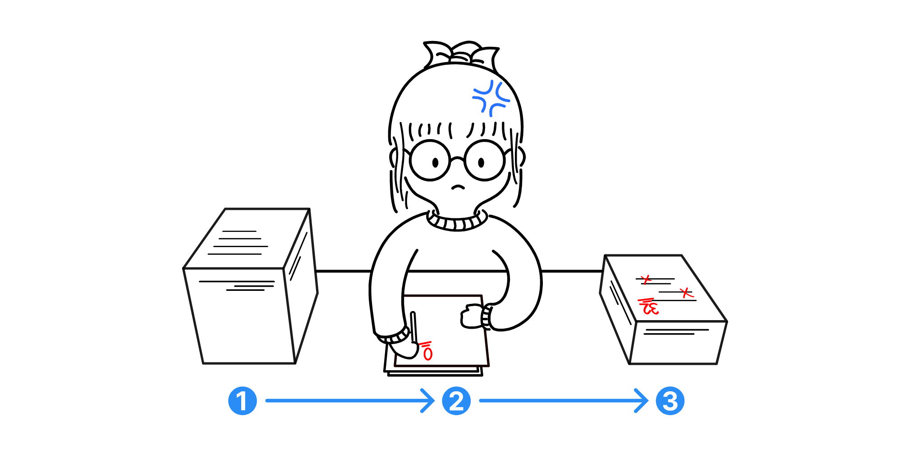
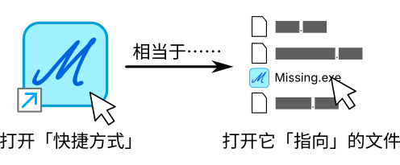
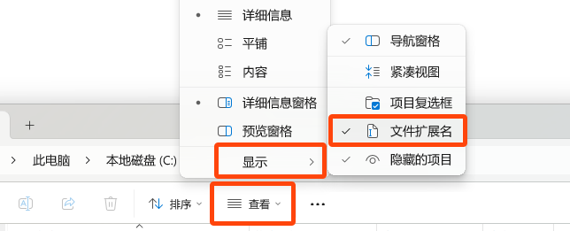
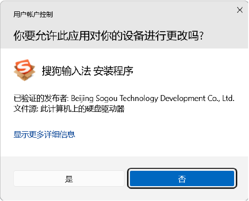
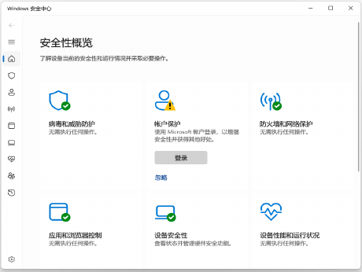
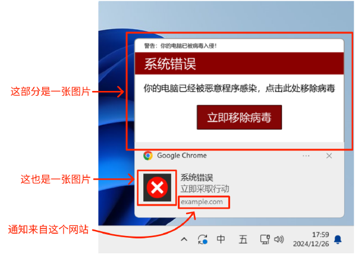
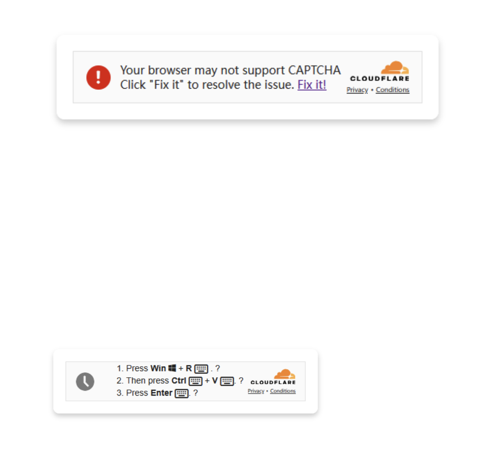
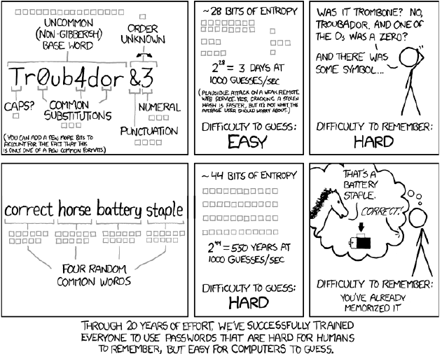

## 基本知识扫盲

### 推荐阅读（也是灵感来源）

[你缺失的那门计算机课](https://www.criwits.top/missing/) 新手向，计算机快速上手

> 我们计划的课程在这里！

[MIT: Missing Semester](https://missing-semester-cn.github.io/) 进阶向，需要配置好 Bash 环境

<!--s-->

# 计算机的基本知识

<!--v-->
<!-- .slide: class="fragmented-lists" -->
<!-- 上面一行加在分隔符后，可将 List 自动按 Fragment 出现 -->

## 硬件：计算机的躯体

- 计算机的基本任务流是：输入，处理，输出
- **中央处理器（CPU）**：常见桌面平台处理器有 Intel Core, AMD Ryzen，他们负责**处理**数据
- **“内存”（RAM，随机访问存储器）**\*：用来**临时存储**待处理的数据，台式机内存通常为条状，故称内存条
- **外存（外部存储器）**：用来**永久存储**数据，例如：硬盘，U盘等
- **显卡（GPU）**：主要负责图形的处理，和 CPU 有着逻辑的根本区别，当前也流行用于 AI 训练

<div class="row"> <!-- 并行布局示例 -->

  <div class="col">



<!-- 使用 | 后加数字来指定大小 -->

  </div>

  <div class="col">

- 老师 拿起 作业 批改 摞好 完成
- 电脑 输入 数据 处理 输出 完成
- <small>准确的说，内存是内部存储器的简称，实际上分为许多类型，而且不止在内存条中，RAM 只是其中最广为人知的一部分，这里为了简单并未展开</small>

  </div>

</div>

<!--v-->

# 软件：计算机的灵魂

<!--v-->
<!-- .slide: class="fragmented-lists" -->

## 操作系统

- Windows / MacOS / Linux / FreeBSD / ... 都是桌面端操作系统
- Android (AOSP) / iOS / HarmonyOS NEXT / ... 都是移动端的操作系统
- 操作系统是软件的载体，是一套复杂的底层“软件”
  - 如何丝滑的切换程序？
- 不同的硬件说不同的“语言”，移植一个程序需要重写
  - Intel: Hello~, AMD: Ciallo～(∠・ω< )⌒★
- 操作系统提供了相对统一的“接口”，让不同的硬件能够运行同一个程序

<!--v-->

## 按下电源之后：BIOS / UEFI

- CPU 刚启动时，操作系统还没有运行
- 主板上的一小段程序会首先工作，检查并初始化 CPU、内存、硬盘等硬件
- 它会寻找可以启动的设备，并把操作系统“叫醒”
- 现代电脑通常使用 **UEFI**；大家习惯上仍会把设置界面叫作“BIOS”
- 常见用途：调整启动顺序、开启虚拟化、查看硬件状态
- 不清楚选项含义时，不要随意修改 BIOS / UEFI 设置

<!--v-->

## 驱动程序：操作系统与硬件的翻译官

- 不同型号的显卡、网卡、打印机有不同的控制方式
- **驱动程序（Driver）**告诉操作系统如何使用某个具体硬件
- 操作系统提供统一接口，驱动程序负责把请求翻译给硬件
- 没有合适的驱动，硬件可能无法使用、功能不完整或运行不稳定
- Windows 通常会自动安装驱动；显卡等设备有时需要从厂商官网下载
- 不要使用来源不明的“万能驱动”工具

<!--v-->

## 程序与“快捷方式”

- 躺在你桌面的只是一个“路牌”，告诉你的操作系统，这个程序的“入口”在哪里
- 所以拷贝快捷方式就相当于搬走一个路牌，换一个地方（电脑）当然找不到的



<!--v-->

## 文件：内容的具体形式

<div class="row">

<div class="col">

- 当前大多数系统都是依靠“后缀名”来区分类型
- 文件本质上的名字是 `文件名.后缀名`
- **打开后缀名**，可以防止你遭受伪装称正常文件的“图标”的欺骗
- **打开隐藏的项目**，你可能能够发现更多有意思的东西
- `.txt`: 文本文件; `.exe`: Windows 可执行程序; `.doc/docx`: Word 文件; `.py` Python 代码文件 etc.
- 建议使用 **英文** 命名你的文件夹和文件，很多程序不能很好兼容中文名
- 如何管理好你的文件？[这里](https://www.criwits.top/missing/file-and-file-management.html)有一份参考

</div>

<div class="col">



</div>

</div>

<!--v-->

## 二进制：逢 2 进 1

- 二进制：计算机内部运算中采用的进制
- 我们习惯的是 10 进制，逢 10 就往高位进位，因此你只能看见 0~9
- 2 进制同理，逢 2 就往高位进位，因此你只能看见 0 和 1
- `0`, `1`, `10`, `11`, `100`, `101` ...
- 转换为 10 进制
  - 10 进制每一位代表 $10^{n}$，同理，2 进制每一位代表 $2^{n}$
  - $120 = 1 \times 10^{2} + 2 \times 10^{1} +0 \times 10^{0}$; $(110)_{2}=1 \times 2^{2} + 1 \times 2^{1} + 0 \times 2^{0}=6$
  - 16 进制：没有比 9 大的个位数了！`=>` `0123456789abcdef`
- 十进制转？进制
  - 短除法

<!--v-->

## 二进制：逢 2 进 1 (cont'd)

我们以二进制为例：
整数部分，把十进制数不断执行除 $2$ 操作，直至商数为 $0$。读余数==**从下读到上**==，即是二进制的整数部分数字。

```txt
将33转化为二进制数
33/2=16 ......1
16/2=8  ......0
8/2=4   ......0
4/2=2   ......0
2/2=1   ......0
1/2=0   ......1

=> 33 = 0b100001
```

小练习：尝试推出 `33 = 0x21` (16 进制)

<!--s-->

<div class="middle center">
  <div style="width: 100%">

# 安全——一夫当关，万夫莫开

  </div>
</div>

<!--v-->

## 你的密码/信息是如何被偷走的

- 恶意软件
- 系统漏洞
- 钓鱼网站（邮件、QQ 链接常用）
- 弱密码
- 社会工程学

<!--v-->

## UAC 是什么（Windows 特辑）

- 你可能见到过 UAC 弹窗，全称 User Account Control 用户账户控制



- 通常你只会觉得，好烦人，不点击就安装不了程序/运行不了外挂/……
- “提权”：软件向系统申请提升权限（用来访问目录、改变底层设置等）
- In short，**如果电脑弹出了不明的 UAC 弹窗，请一律拒绝，不运行来源不明的可执行文件！**

<!--v-->

## Windows 更新和安全防护软件

<div class="row">

<div class="col">

- 更新分为许多种：体验更新、驱动程序更新、系统补丁
- 永恒之蓝
- **不要完全禁用更新，更不要打断系统更新**
- 简单的安全防护软件是必要的，但是请不要安装多个！
- 当心捆绑全家桶
- 自带的 Windows Defender 其实也挺好了

</div>

<div class="col">



</div>

</div>

<!--v-->

## 如何辨别钓鱼网站/高仿弹窗

<div class="row">

<div class="col">

- 认识常见的域名
- 用好的没有广告的搜索引擎
- 安装安全防护软件 + 弹窗拦截

</div>

<div class="col">



</div>

</div>

<!--v-->

## (例)伪装 Cloudflare 验证诱导运行恶意代码

<div class="row">

<div class="col">

- Cloudflare 是一个主流的提供流量筛查（人机验证）的服务商
- 利用人们的信任和急于解决问题的心理
- 运行恶意代码

</div>

<div class="col">



</div>

</div>

<!--v-->

## 如何设置一个强大的密码

- 密码管理器
- 随机密码（不太推荐）
- 真正强的密码.jpg



<!--v-->

## 社会工程学的防范

- 你的信息已经不是自己的了
- 少输入个人信息
- 少访问信誉低/不知名的网站，甚至填写信息……
- 密码多样

<!--s-->

<div class="middle center">
  <div style="width: 100%">

# 工欲善其事，必先利其器

  </div>
</div>

<!--v-->

## VSCode，其实就是“记事本”

- VSCode 是一个**代码编辑器**，本质上就是一个花里胡哨的“多功能记事本”
- VSCode 有一系列插件来扩展功能，虽然它**不能编译代码**，但是可以自动调用已有的程序（当你点击运行的时候，会~~在幕后~~自动帮你打命令）
- 轻量的 VSCode 配上丰富的插件，可以媲美 IDE
- IDE: 集成开发环境，通常更笨重，但集成度更好（例如：Visual Studio）

<!--v-->

## PyCharm

- JetBrain 开发的 IDE
- 比起 VSCode 更笨重一点，针对了 Python 优化
- 为了之后学习 C/C++ 等更方便，我们 SI 100+ 统一采用 VSCode
- PyCharm 可能不会得到支持 `:-(`

<!--v-->

## 终端：神秘的黑客工具？

<div class="row">

<div class="col">

- 你可能听过命令行、命令提示符、终端、交互式 Bash
- Windows 按下 `Win 徽标键` + `X`，选择 `终端` or `Windows PowerShell` 即可打开终端，MacOS 按下 `Command`+`Space` 输入 `terminal` 按下回车
- 尝试打开终端，输入 `echo Hello, World` 并回车
- 终端是最原始，但是效率上限最高的交互方式
- 终端是**交互式**的，输入完**一句**指令，立马就能执行并得到结果

</div>

<div class="col">

1. 使用 `cd` 命令可以浏览不同目录，空格用来区分参数
2. `cd`, `mkdir`, ``
3. 按下 'Tab' 可以补全
4. Windows 按下鼠标右键相当于粘贴
5. 使用上下进行浏览
6. 某些程序可以直接在终端运行
7. VSCode 在“运行”代码的时候，会弹出终端并自动帮你输入命令来运行你的代码

</div>

</div>

想要了解更多？ 请看 [命令行的艺术](https://github.com/jlevy/the-art-of-command-line/blob/master/README-zh.md)!

<!--v-->

## 虚拟机：不关机就能体验不同系统

- 虚拟机区别于实体机，所有的硬件都是“虚拟”出来的，大多数情况是与你的系统完全隔离的
- 虚拟机可以以极低的代价让你体验不同的系统（推荐试试 Ubuntu），也可以用于软件测试
- 常见的虚拟机软件有 VMWare / Virtual Box
- 感兴趣的可以去b站、油管等搜索高播放的视频

> 另：[Docker](https://csdiy.wiki/必学工具/Docker), [WSL](https://learn.microsoft.com/zh-cn/windows/wsl/install) 也用到了虚拟化技术，感兴趣的可以自行搜索

<!--v-->

## 搜索引擎——更有效地获取信息

<!-- .slide: class="fragmented-lists" -->

- 推荐：
  - Official documents / websites (CSDN 不推荐):
    - Bing 搜出来的一些小博客，可能远比 CSDN 好用
  - https://docs.python.org/3/tutorial/index.html
  - Bing / Google 而不是 百度
  - StackOverflow.com
- 如何辨别“广告” - 看右下角是否有广告字样，看域名是否是 `公司/软件名.com`
  - 详情：[你缺计课](https://www.criwits.top/missing/software-installation.html)
- 英语的技能是必备的：后续我们接触到的大多数软件的官方文档都是英文的

<!--v-->
<!-- .slide: class="fragmented-lists" -->

## 重要的是自学 + 多问 + GPT

- 你会在未来遇到很多问题，绝大多数都有可能有人帮你（同学、老师、TA）
- 部分的问题，如今交给 GPT 就能解决
- 少部分的问题，可以用搜索引擎在犄角旮旯中找到
- 极少数的问题，可能需要高人指点（StackOverflow 发帖）
- [CS 自学指南](https://csdiy.wiki/)
- [提问的智慧](https://github.com/ryanhanwu/How-To-Ask-Questions-The-Smart-Way/blob/main/README-zh_CN.md)
